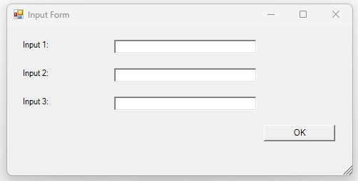
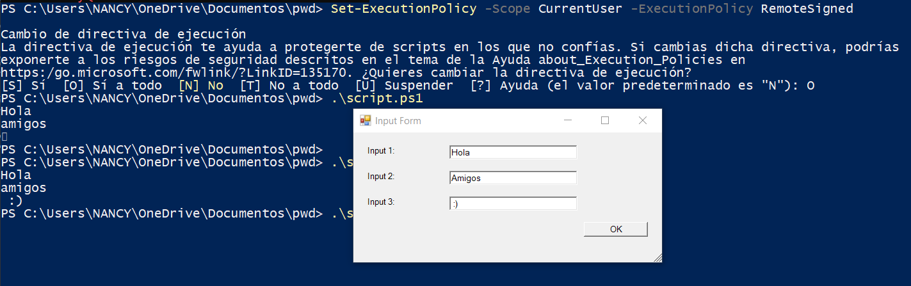
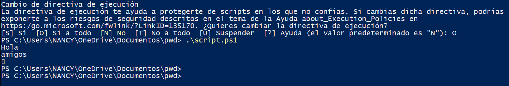

# scriptarq

Explicación del código
#Importa librerías para la interfaz gráfica de powershell
Add-Type -AssemblyName System.Windows.Forms
Add-Type -AssemblyName System.Drawing

#Se crea el formulario
$form = New-Object System.Windows.Forms.Form
$form.Text = "Input Form" #Se asigna el título de la ventana
$form.Size = New-Object System.Drawing.Size(500,250) # Se asigna el tamaño de la ventana en píxeles
$form.StartPosition = "CenterScreen" #Indica el lugar en donde aparecerá la ventana

############# Define labels / #Se crean las 3 etiquetas de input
$textLabel1 = New-Object System.Windows.Forms.Label
$textLabel1.Text = "Input 1:" #El texto que mostrará la ventana
$textLabel1.Left = 20 #Posición(Ubicación) horizontal
$textLabel1.Top = 20 # posición(Ubicación) vetical
$textLabel1.Width = 120 #Ancho del texto

$textLabel2 = New-Object System.Windows.Forms.Label
$textLabel2.Text = "Input 2:" #El texto que mostrará la ventana
$textLabel2.Left = 20 #Posición(Ubicación) horizontal
$textLabel2.Top = 60 # posición(Ubicación) vetical
$textLabel2.Width = 120 #Ancho del texto

$textLabel3 = New-Object System.Windows.Forms.Label
$textLabel3.Text = "Input 3:"
$textLabel3.Left = 20 #Posición(Ubicación) horizontal
$textLabel3.Top = 100 # posición(Ubicación) vetical
$textLabel3.Width = 120 #Ancho del texto

#CREACIÓN DE LAS CAJAS DE TEXTO: se crean las cajas de texto y se posicional a un lado de cada etiqueta#

############# Textbox 1-caja 1
$textBox1 = New-Object System.Windows.Forms.TextBox
$textBox1.Left = 150 #Posición(Ubicación) horizontal
$textBox1.Top = 20 # posición(Ubicación) vetical
$textBox1.Width = 200 #Ancho de la caja de texto

############# Textbox 2- caja 2
$textBox2 = New-Object System.Windows.Forms.TextBox
$textBox2.Left = 150 #Posición(Ubicación) horizontal
$textBox2.Top = 60 # posición(Ubicación) vetical
$textBox2.Width = 200 #Ancho de la caja de texto

############# Textbox 3-caja 3
$textBox3 = New-Object System.Windows.Forms.TextBox
$textBox3.Left = 150#Posición(Ubicación) horizontal
$textBox3.Top = 100 # posición(Ubicación) vetical
$textBox3.Width = 200 #Ancho de la caja de texto

#SE ESTABLECE QUE LAS CAJAS ESTARÁN VACÍAS#

############# Default values
$defaultValue = ""
$textBox1.Text = $defaultValue
$textBox2.Text = $defaultValue
$textBox3.Text = $defaultValue

#Creación del botón de ok#

############# OK Button
$button = New-Object System.Windows.Forms.Button
$button.Left = 360 #Posición(Ubicación) horizontal
$button.Top = 140 # posición(Ubicación) vetical
$button.Width = 100 #Ancho del botón
$button.Text = "OK" #Texto dentro del botón 

############# Button click event- lo que sucede al hacer click en el botón "OK"
$button.Add_Click({
    $form.Tag = @{ #Se guarda la información asignada en las cajas de texto
        Box1 = $textBox1.Text
        Box2 = $textBox2.Text
        Box3 = $textBox3.Text
    }
    $form.Close()# Se cierra la ventana
})

############# Add controls -  Se asignan los controles #se asigna qué partes del código serán visibles en la interfaz
$form.Controls.Add($button)
$form.Controls.Add($textLabel1)
$form.Controls.Add($textLabel2)
$form.Controls.Add($textLabel3)
$form.Controls.Add($textBox1)
$form.Controls.Add($textBox2)
$form.Controls.Add($textBox3)

############# Show dialog
$form.ShowDialog() | Out-Null #Muestra la ventana como un cuadro de diálogo y Out-Null evita que PowerShell imprima basura extra en la consola.

############# Return values
return $form.Tag.Box1, $form.Tag.Box2, $form.Tag.Box3 # Una vez cerrada la ventana, estos valores se devuelven al script

